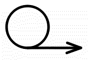

#   **CerCall**

**A library for serializing function calls.**

Yet another approach to the client-server / microservices programming, leveraging
modern C++ features, like variadic templates, `std::function` and lambdas.

This is a headers-only C++ library.

## Requirements

* C++14 or later C++ standard
* Either Boost.Asio or Asio Standalone
* Optionally Cereal library.
* Optionally Googletest library for building unit tests (with full sources in the same parent folder as cercall).

## Design Goals

* No IDL - service interfaces described directly in C++. Any serializable C++
type can be used as a CerCall function parameter or returned result.
* Asynchronous call model - the function call result is delivered by calling
a closure (sort of "inline callback") function.
* CerCall depends on external serialization libraries to serialize/deserialize function parameters and results. No built-in protocol needed, except for a simple message size header.
* Calling functions on remote services just like any C++ class function
(with some limitations though - see below).
* Broadcasting asynchronous events from a service to all connected clients.
* Polymorphic types of parameters and events can be used if supported by
the chosen serialization library.
* A CerCall interface can be independent of the serialization protocol.
* Transport layer abstracted away to allow implementing transport adapters for
any I/O library of choice.

## Currently implemented features

* Support for Cereal and Boost Serialization libraries.
* Binary or text (Json, XML) serialization.
* Support for either Asio Standalone or Boost Asio.
* Support for Asio tcp sockets.
* Support of Qt sockets available as a separate library (CerQall).
* Support for interface inheritance.
* Support for one-way function calls.
* Queueing of function calls on the client side.
* Reusing binary archives for better performance.
* Debug logs with user-provided debug implementation.
* Unit-tests with a decent line coverage (~95%).

## Current Limitations

* Single-threaded - the functions (on the client side) and closures (on the service side) must be called by the same context which processes the I/O events (e.g. calls the io_context::run() function). It does not mean that threads cannot be used by the application - just wrap the code which calls a CerCall function in a lambda and post it into the io_context which handles the CerCall I/O operations.
Threads add complexity to every program. With CerCall it is easy to add another process instead of a thread. I follow the **KISS** principle and try to avoid threads in the first place, preferring asynchronous approaches.
* Function overloading is not supported - every CerCall function in an interface must have a unique name.
* Developed and tested under Linux only.

## Dependencies

Developed and tested on Ubuntu 18.04.1, with:

* Asio Standalone ver. 1.10.6, 1.12.1, 1.18.1
* Boost ver. 1.67, 1.75
* Googletest ver. 1.7.0
* Cereal ver. 1.2.2, 1.3.0
* gcc ver. 7.3.0, 7.5.0, 10.1.0
* clang ver. 11

## A quick how-to

* Define the interface class of your service. (See clockinterface.h for an example.)
The CerCall interfaces must be registered with the `O_REGISTER_TYPE` or `O_REGISTER_DERIVED_TYPE` macros. A CerCall interface must consist of C++ abstract virtual functions, and can also contain definition of types used as function parameters or results.
Use the `Closure` template as the last function parameter in every non-one-way function.
Define EventType if the service shall broadcast events to its clients.
* Implement the client class for the service. (See clockclient.h)
Every CerCall function on the client side must be implemented with a single call to `send_call` with the `__func__` as the first argument. A CerCall client must inherit from `cercall::Client` specialized with the interface class and the serialization class (when the interface does not inherit from it).
* Implement the service class. (See clockservice.h, clockservice.cpp)
It must inherit from the `cercall::Service` specialized in the same fasion as the Client class. In the service constructor, add service functions to the CerCall function dictionary using the `O_ADD_SERVICE_FUNCTIONS_OF` macro.
Each service function that has the `Closure` parameter has to call the closure, or save it to be called later when the result is ready. Note that a client cannot call the same function a 2nd time to a service without receiving the result of the 1st call.
* To instantiate the service, create an acceptor for the transport, then create the service instance passing it the acceptor. Following its instantiation the service needs to be started with the `start()` function. Then start the I/O event processing loop.
* On the client side, first create a client-side transport instance, then instantiated the client object, transferring the ownership of the transport to the client. Once the client is created, add any service listeners to receive service events. Then the connection to the service can be established by calling the `open()` member function. After that the client can call functions on the service.

## Notes

Currently the `BasicStreamTransport::write()` is implemented using synchronous (blocking) write. To avoid implementing asynchronous write, consider enlarging the TCP buffer size for the underlying socket (large data transfers, slow networks). The operating system is likely more efficient buffering data then a custom buffering implementation.

## To Do

* Unit-testing with various C++ compilers.
* Unit-testing on Windows.
* Propagation of exceptions from a service to its clients.
* Versioning of function interfaces.
* Event subscription mechanism.
* Further optimization.
* Better documentation.
* Multi-threading support.

## Credits
Many thanks to the StackOverflow community for providing ideas for this library.
